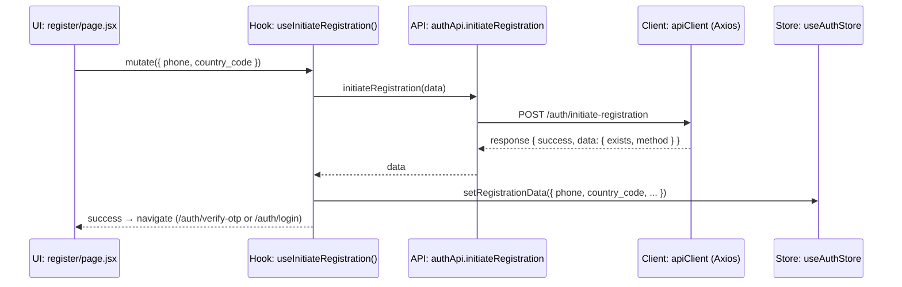
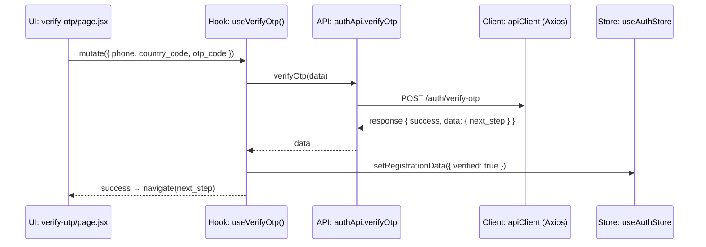
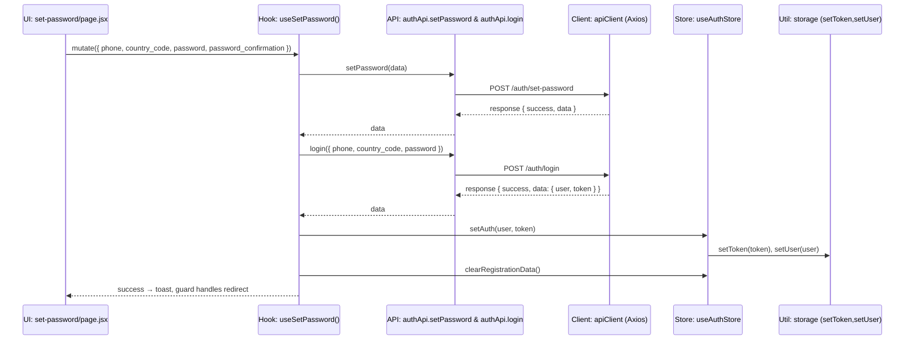
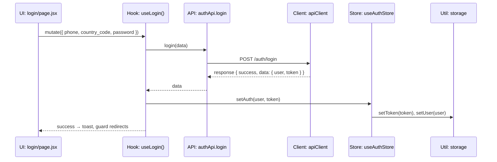
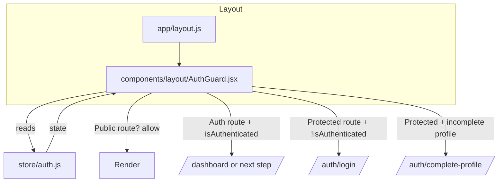
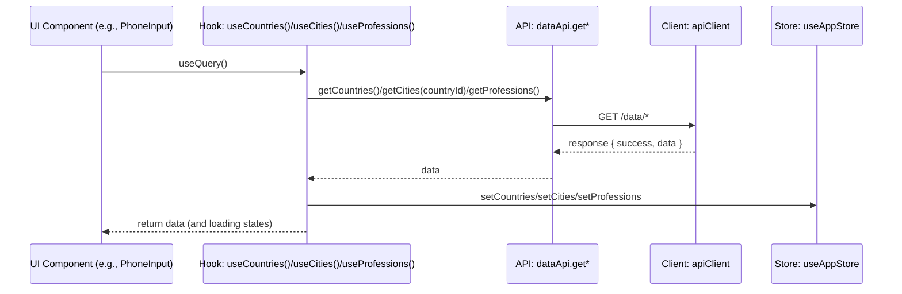

# Data Flow and Sequence Diagrams

This document explains, step by step, how user inputs move through components, hooks, APIs, and stores. Mermaid diagrams illustrate the control and data flow.

Legend:

-   UI = Page/Component under `app/` or `components/`
-   Hook = React hook in `hooks/`
-   Store = Zustand store in `store/`
-   API = API layer in `lib/api/`
-   Client = Axios client in `lib/api/client.js`
-   Util = Helper in `lib/utils/`

## 1) Registration: Enter phone → Send OTP

Flow summary:

-   UI `app/auth/register/page.jsx` uses `react-hook-form` + `initiateRegistrationSchema`
-   Calls Hook `useInitiateRegistration()` → API `authApi.initiateRegistration()` → Client attaches token (none yet) → server responds
-   On success, Store `useAuthStore.setRegistrationData()` updates registration flow



Key files:

-   UI: `app/auth/register/page.jsx`
-   Hook: `hooks/useAuth.js::useInitiateRegistration`
-   API: `lib/api/auth.js::authApi.initiateRegistration`
-   Client: `lib/api/client.js`
-   Store: `store/auth.js::setRegistrationData`
-   Validation: `lib/validations/auth.js::initiateRegistrationSchema`

## 2) Verify OTP



Key files:

-   UI: `app/auth/verify-otp/page.jsx`
-   Hook: `hooks/useAuth.js::useVerifyOtp`
-   API: `lib/api/auth.js::authApi.verifyOtp`
-   Validation: `lib/validations/auth.js::verifyOtpSchema`

## 3) Set Password (auto-login)



Key files:

-   UI: `app/auth/set-password/page.jsx`
-   Hook: `hooks/useAuth.js::useSetPassword`
-   API: `lib/api/auth.js::authApi.setPassword`, `authApi.login`
-   Store: `store/auth.js::setAuth`, `clearRegistrationData`
-   Util: `lib/utils/storage.js`
-   Validation: `lib/validations/auth.js::setPasswordSchema`

## 4) Login



Key files:

-   UI: `app/auth/login/page.jsx`
-   Hook: `hooks/useAuth.js::useLogin`
-   API: `lib/api/auth.js::authApi.login`
-   Store: `store/auth.js::setAuth`
-   Util: `lib/utils/storage.js`
-   Validation: `lib/validations/auth.js::loginSchema`

## 5) Complete Profile

```mermaid
flowchart TD
    A[UI: complete-profile/page.jsx] -->|collect optional/required fields| B[Zod: completeProfileSchema]
    B --> C[Hook: useCompleteProfile()]
    C --> D[API: authApi.completeProfile]
    D --> E[Client: POST /auth/complete-profile]
    E -->|{ success, user }| F[Store: useAuthStore.setUser(user)]
    F --> G[AuthGuard checks profile completion → redirect]
```

Key files:

-   UI: `app/auth/complete-profile/page.jsx`
-   Hook: `hooks/useAuth.js::useCompleteProfile`
-   API: `lib/api/auth.js::authApi.completeProfile`
-   Store: `store/auth.js::setUser`
-   Validation: `lib/validations/auth.js::completeProfileSchema`

## 6) Guarded Navigation (Public/Auth/Protected)



Key files:

-   Layout: `app/layout.js`
-   Guard: `components/layout/AuthGuard.jsx`
-   Store: `store/auth.js`

## 7) Token Lifecycle and Axios Interceptors

```mermaid
sequenceDiagram
    participant Store as Store: useAuthStore
    participant Util as Util: storage.js
    participant Client as Client: apiClient (Axios)
    participant API as API: authApi.getMe
    participant UI as UI: AppProvider.initialize

    UI->>Store: initialize()
    Store->>Util: getToken(), getUser()
    Store-->>UI: set isAuthenticated if present
    Store->>API: getMe() (background)
    API->>Client: GET /auth/me (Authorization: Bearer <token>)
    Client-->>API: response { success, data: { user } } OR 401
    API-->>Store: if success → setUser(freshUser); if 401 → clearAuth()

    Note over Client: Interceptor behaviors
    Client->>Client: request: add Authorization if getToken()
    Client->>Client: response: on 401 → removeToken(), window.location='/auth/login'
    Client->>Client: response: on 403+"Profile incomplete" → redirect '/auth/complete-profile'
```

Key files:

-   Client: `lib/api/client.js`
-   Store: `store/auth.js::initialize`, `clearAuth`, `setUser`
-   Util: `lib/utils/storage.js`
-   Provider: `components/layout/AppProvider.jsx`

## 8) Data Lists (Countries/Cities/Professions)



Key files:

-   Hooks: `hooks/useData.js`
-   API: `lib/api/data.js`
-   Store: `store/app.js`

---

If you want, we can embed these diagrams into `ARCHITECTURE.md` or link to this file from each page’s header for quick onboarding. We can also generate PNG/SVG exports for inclusion in external docs or a wiki.
